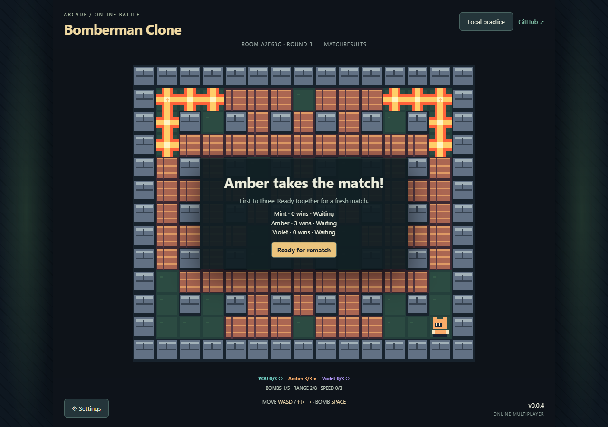

# Bomberman Clone

An original SNES-inspired 2D bomb arena built with Babylon Lite and authoritative competitive Colyseus multiplayer.

[**Play Multiplayer Demo — v0.0.4**](https://samuelasherrivello.github.io/babylon-lite-bomberman-clone/?mode=online)

Create a room and share its code or copied room link with a friend. Requires a WebGPU-capable browser; two to four players. The server has an accepted five-minute session limit. In-memory hosting can also interrupt admission or recovery before that limit; if the room expires or recovery fails, create a new room. Host resets do not preserve scores or identity.

## Original AI Prompt

<details>
<summary>Read the full original prompt (edited for grammar, punctuation, spelling, and formatting)</summary>

```text
Update this prompt to be for Bomberman for SNES, a 2D multiplayer game using Colyseus.

$ai-skills-create-game

- Title: [Enter the Gungeon Clone]
- Type: [Multiplayer, online cooperative, 2–4 players. All human players cooperate on the same team.]
- World and camera:
  - [Create one 2D level approximately twice the viewport width and twice its height, giving it about four times the area of one screen.]
  - [The level may be tile-based or use freely placed artwork and geometry.]
  - [Use a top-down orthographic camera that smoothly follows the local player and stays within the level boundaries.]
- Core loop: [Cooperate to survive increasingly difficult enemy waves, dodge bullet patterns, collect loot, and choose weapon upgrades between waves. Defeat a boss every five waves. The run ends when the entire team is down.]
- Controls: [WASD movement, mouse aiming, left-click shooting, and Space to dodge roll with a short cooldown and brief invulnerability.]
- Cooperative mechanics:
  - [Create or join a room using a shareable room code, then ready up together.]
  - [Revive downed teammates, share upgrade rewards, and disable friendly fire.]
  - [Scale enemy counts and difficulty with the number of active players.]
  - [Show directional indicators for teammates outside the local camera view.]
- Look and feel:
  - [Original pixel-art dungeon scenery with stone floors, destructible props, and readable cover.]
  - [Distinct player colors, expressive enemies, bright projectiles, punchy muzzle flashes, and clear hit feedback.]
  - [Keep enemy bullets visually distinct from friendly shots. Show player health, teammate status, current wave, remaining enemies, and dodge cooldown.]
- Gameplay requirements:
  - [Include three starting weapons with distinct firing patterns and meaningful upgrades.]
  - [Include enemies that chase, fire aimed shots, and emit radial bullet patterns.]
  - [Provide short breaks between waves for upgrades and a team restart option after defeat.]
- Multiplayer server and smoothness:
  - [Use https://github.com/SamuelAsherRivello/rmc-colyseus-multiplayer-server or my writable fork: <fork URL, if applicable>.]
  - [Automatically update the selected server repository with the room logic and synchronized state required by this game.]
  - [Make the server authoritative for movement validation, combat, enemy spawning, damage, loot, revives, and wave progression.]
  - [Use supported Colyseus prediction features where available, or implement suitable client-side prediction, server reconciliation, and interpolation.]
  - [Respond immediately to local movement and dodge inputs. Smooth reconciliation corrections and drive the camera from the predicted local character position to avoid visible jitter.]
  - [Interpolate remote players and enemies. Use immediate local animations, muzzle flashes, and cosmetic effects while reconciling gameplay outcomes with the server.]
  - [Use deterministic projectile motion or other bandwidth-efficient synchronization where appropriate.]
  - [Prioritize a smooth, consistent experience for every player over action density. If synchronization struggles, reduce concurrent bullets, enemies, spawn rates, and firing rates.]
  - [Handle disconnects and reconnects gracefully.]
  - [Verify with at least two browser clients, including simulated latency and jitter. Check responsive local movement, stable camera tracking, smooth remote motion, and consistent combat outcomes.]
- Inspiration links:
  - [https://store.steampowered.com/app/311690/Enter_the_Gungeon/]
- Inspiration screenshots: [Attach reference screenshots here.]
- Originality requirement: [Keep the requested project title, but create original artwork, sounds, characters, weapons, UI, and level layouts; use the reference only for gameplay and visual inspiration.]
```

Prompt links: [Multiplayer server](https://github.com/SamuelAsherRivello/rmc-colyseus-multiplayer-server) · [Enter the Gungeon](https://store.steampowered.com/app/311690/Enter_the_Gungeon/)

</details>

This earliest request asked to adapt the supplied Gungeon template into a SNES-inspired Bomberman game. The [approved Bomberman brief](project-name/documentation/approved-game-brief.txt) records the subsequent requirements used for implementation, including the three OpenSpec milestones.



## Current status

All three OpenSpec milestones are complete, synced and archived. Gameplay Polish delivers power-ups, sudden death, first-to-three matches, automatic rounds, rematches, animated original artwork, music/effects, mute and volume, and smooth local/remote movement. Public v0.0.4 passed a complete two-browser match/rematch, legal pickups/chains, simulated latency/jitter, recovery and simultaneous touch controls. Screenshots show current public play; the draw screenshot shows a real-time local two-browser check. See the [delivery audit](project-name/documentation/delivery-audit.md) for evidence and disclosed limits.

## Getting Started

Use Node 24 or newer and npm, from the repository root:

```sh
npm ci
npm test
npm run dev
```

Open the URL Vite prints. The application requires a WebGPU-enabled browser and compatible device. A useful error appears if the adapter is unavailable. Build with `npm run build`; serve the production build with `npm run preview`.

### Controls

WASD or arrow keys move; Space places a bomb. Touch devices have direction and bomb buttons with simultaneous touch support. Bombs explode after 2.5 seconds and remain dangerous for 0.5 seconds. You can leave your newly placed bomb but cannot return through it. Destroy brick blocks and escape your own explosions. Settings pauses local practice; Resume continues and Restart resets the arena.

### Online play

Choose **Play online**, create a room and share its six-character code or use **Copy room link**. Friends join, then everyone chooses a color and readies up. Two to four connected players can start. Eliminated players and mid-round arrivals spectate. Each round winner gains one point; rounds advance automatically, upgrades reset, and the first to three wins the match. Everyone readies again for a rematch.

Destroyed blocks can reveal bomb-slot, range and speed upgrades after flames clear. Start with one bomb slot and range two; caps are five bombs, range eight and three speed upgrades of 15% each. Later blasts destroy exposed items. In a round's final 30 seconds, tiles warn for one second before inward walls close. Rounds last at most two minutes; simultaneous final eliminations draw without points.

Online settings and focus loss stop your input while the shared battle continues. A disconnected character remains vulnerable, with its seat reserved for 15 seconds. Recovery can preserve identity and score while the same room survives. The accepted five-minute host limit and process resets can end a room; use **Create room** to play again. Local practice works independently of the backend. Settings control original music/effects with mute and volume; add `mute=1` to the URL for forced silent testing. [Audio provenance](project-name/documentation/audio.md).

The client pins the shared release package and defaults to `https://rmc-colyseus-multiplayer-server.vercel.app`. For local server testing, set `VITE_MULTIPLAYER_SERVER` to your server URL before starting Vite. This is a public endpoint setting, not a secret. See [multiplayer verification and hosting limits](project-name/documentation/multiplayer-verification.md).

### Rendering and assets

The viewport has one fixed landscape ratio of 320:272, with four outside gutters. The rendered arena is 240×208 logical pixels: 15×13 tiles at 16px. HUD and touch controls have separate CSS space above/below it, including in portrait browser windows and fullscreen. There is no orientation selector. Native DPR-aware rendering, integer CSS fit, nearest texture sampling and no mipmaps/MSAA preserve sharp artwork; small viewports use positive fractional fit. [Rendering details and asset provenance](project-name/documentation/rendering.md) and [deterministic rules](project-name/documentation/game-rules.md) describe the implementation. All current game textures are original code-authored pixel art.

## OpenSpec milestones

1. Foundation: local arena, controls, rules and 2DPixelPerfect presentation.
2. Multiplayer Setup: authoritative Colyseus rooms, ready states, synchronization, reconnection and deployed two-client verification.
3. Gameplay Polish: power-ups, scoring, sudden death, spectator/rematch flows, original audio/effects and final public release.

Explore → propose → apply → verify → sync specifications → archive → scoped commit and push. Each milestone must pass before the next proposal. See [active changes](openspec/changes/), [accepted specifications](openspec/specs/) and the [complete delivery contract](openspec/changes/archive/2026-10-01-foundation/delivery-brief.md). Generated repository-local skills are in `.agents/skills/`; their version matches OpenSpec 1.14.0. Reopen Codex if skill autocomplete has not refreshed.

## Final delivery target

The multiplayer link above opens the live online lobby without installation or credentials. Two independent public browsers verified a first-to-three match and fresh rematch, public assets, endpoint connectivity, controls, scoring and displayed v0.0.4.

Client release uses the existing Release GitHub Actions workflow and `version.txt`. Run the **Release** workflow, then **Deploy to GitHub Pages** for the generated version commit. Pages deploys `project-name/dist/` under `/babylon-lite-bomberman-clone/`. [Game release v0.0.4](https://github.com/SamuelAsherRivello/babylon-lite-bomberman-clone/releases/tag/v0.0.4) and [pinned shared client v0.9.4](https://github.com/SamuelAsherRivello/rmc-colyseus-multiplayer-server/releases/tag/v0.9.4). WIP v0.0.3 was published immediately for playtesting before final acceptance, as requested.

## Verification

Twenty-three automated checks cover arena symmetry, upgrades and caps, collision, bomb capacity/fuse, owner passage, chains, sudden death, deterministic outcomes, pause/restart, scaling, immediate prediction, gradual local reconciliation, uniform remote interpolation under uneven snapshot arrival, and rejected cosmetic bombs. Chrome WebGPU checks exercised keyboard movement/bomb escape, elimination, restart, pause/resume, fullscreen, zoom, unsupported-WebGPU recovery, and emulated mobile multitouch/cancellation at DPR 1.5. Physical touch hardware is unverified.

With the application running and Google Chrome installed, `npm run test:browser` exercises independent browser contexts, private rooms, readiness, authoritative elimination, a late spectator, 180–240ms outbound latency/jitter, pixel-level local movement, remote convergence, full match/rematch, legal pickup/chain, offline recovery and mobile joining. The default application URL is `http://127.0.0.1:5173/babylon-lite-bomberman-clone/`; set `GAME_URL` to use another local or public URL and `BACKEND_URL` only when the application was built for a different backend.

Additional browser checks: `node project-name/test/graphics-browser.mjs`, `node project-name/test/audio-browser.mjs`, `node project-name/test/ui-browser.mjs`, and `node project-name/test/draw-browser.mjs`. They verify actual WebGPU artwork, synthesized audio and gain controls, viewport/fullscreen/unsupported-browser behavior, and a real-time two-browser sudden-death draw with automatic round progression. Draw verification takes approximately 100 seconds. Use `GAME_URL` for the running application and optionally `EXPECTED_VERSION` for the public full-match release check. Audio automation is verified; physical speaker output is unverified.

## References and credits

- [Super Bomberman](https://en.wikipedia.org/wiki/Super_Bomberman): gameplay inspiration.
- [SNES graphics reference search](https://www.google.com/search?udm=2&q=bomberman+snes+graphics): visual inspiration only.
- [Optional browser-game references](https://itch.io/games/html5/tag-bomberman).
- [Repository template](https://github.com/SamuelAsherRivello/github-repository-template) and [shared skills library](https://github.com/SamuelAsherRivello/ai-skills-library).
- Samuel Asher Rivello — Rivello Multimedia Consulting, LLC.
- [Portfolio](https://www.samuelasherrivello.com/) · [GitHub](https://github.com/SamuelAsherRivello/)

Provided as-is under the [MIT License](LICENSE).

